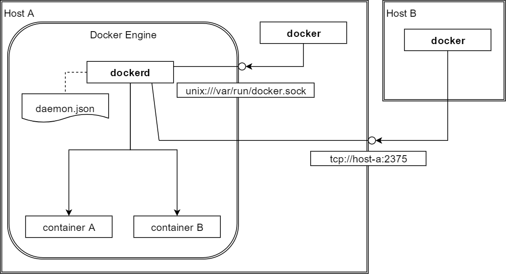

---
## Что такое Docker?
> Docker — программное обеспечение для автоматизации развёртывания и управления приложениями в среде виртуализации на уровне операционной системы. Позволяет «упаковать» приложение со всем его окружением и зависимостями в контейнер, который может быть перенесён на любую Linux-систему с поддержкой cgroups в ядре, а также предоставляет среду по управлению контейнерами

---

### В сравнении с виртуальными машинами

---
### Что такое Docker Engine?
Docker Engine - это клиент-серверное приложение:
- сервер: демон/служба, запущенная командой `dockerd`
- REST API, который определяет интерфейс, реализуемый сервером
- клиент, который пользоваться сервером через командную строку: `docker`

#### Запуск dockerd
- будет запущен сразу после установки
- запускается при старте системы
  - Windows: служба Docker
  - Ubuntu: systemd (15+), upstart (14.04)
- конфигурируется с помощью daemon.json
- пишет логи:
  - Windows:
  - Linux

#### Функционал dockerd
- Создаёт и управляет объектами:
  - `images`
  - `containers`
  - `networks`
  - `volumes`
- Вызывает внешние системы:
  - переходит в режим роя (`swarm mode`), чтобы масштабировать контейнеры, объединённые в сервисы (`services`) между разными демонами
  - ищет образы (`images`) во внешних реестрах (`registry`). Реестр по умолчанию - http://hub.docker.com

#### Основные объекты API
- `images`
- `containers`
- `networks`
- `volumes`
---
#### Клиент docker

+++
#### Попробуем команды
- `docker --help`: получить список доступных команд
- `docker ps`, `docker ps --help`, `docker ps -a`
- `-H dev10-tcagent`
- `docker run hello-world`
+++
#### Попробуем API
- развернём rocketbuildrapid/rapid
  - 
  - sudo docker run -d -p 35200:8080 -v /var/run/docker.sock:/var/run/docker.sock ozlerhakan/rapid
http://dev10-tcagent03:32769/
#### Попробуем Portainer

---
### Docker Image

