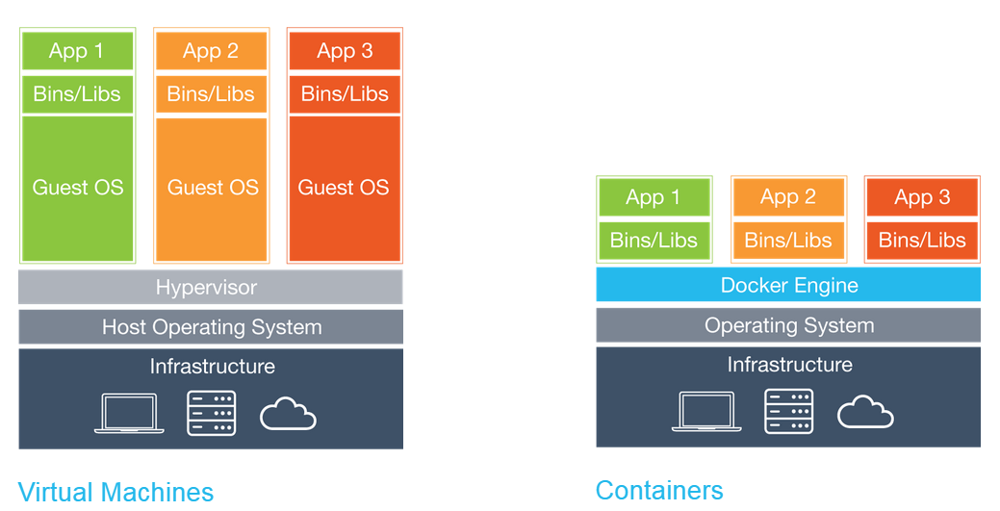
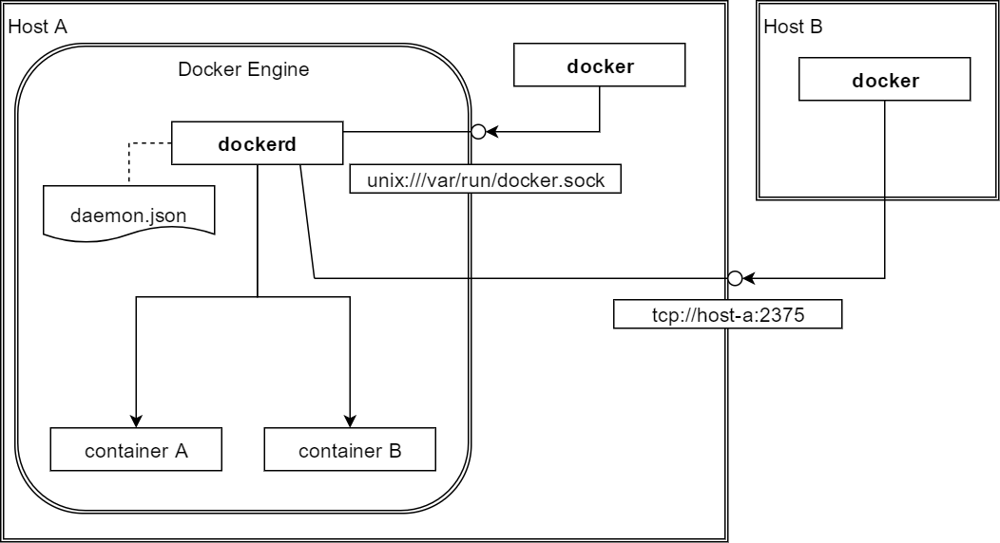

#Используем Docker

---
##Что такое Docker?
>Docker — программное обеспечение для автоматизации развёртывания и управления приложениями в среде виртуализации на уровне операционной системы. Позволяет «упаковать» приложение со всем его окружением и зависимостями в контейнер, который может быть перенесён на любую Linux-систему с поддержкой cgroups в ядре, а также предоставляет среду по управлению контейнерами

+++

###Docker Engine

+++
###Docker Client

